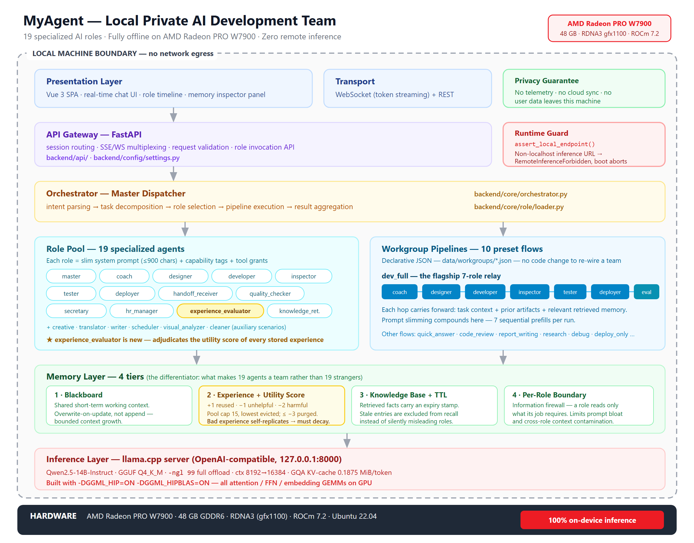

# MyAgent — A Fully Local, Private AI Software Development Team

**2026 AMD AI DevMaster Hackathon · Track 2: Development & Local Deployment of Private AI Agents**

MyAgent is a private AI **software development team**: 19 specialized agent roles that collaborate across the full delivery lifecycle — requirements discovery, design, implementation, architecture review, testing, deployment, cleanup — running entirely on a single AMD Radeon PRO W7900 GPU. No source code, no prompt, and no intermediate artifact ever leaves the machine. There is no remote inference path in the codebase, and the runtime refuses to start if one is configured.

---

## 1. Application Scenario

### 1.1 The problem

Hosted AI coding assistants are now standard tooling — but that creates a hard wall for a large class of users:

| Constraint | Consequence with a hosted assistant |
|---|---|
| **Source code cannot leave the organization** | Defence, medical, financial, and industrial-control codebases are contractually or legally barred from third-party upload. The assistant simply cannot be used on the code that matters. |
| **The network is not there** | Air-gapped labs, on-site industrial deployments, ships, and field installations have no reliable egress. A cloud assistant degrades to zero. |
| **Per-token cost scales with team size** | A multi-agent workflow multiplies token spend. A seven-role pipeline costs roughly seven times a single chat turn, per task, forever. |
| **Data sovereignty and model drift** | Prompts become someone else's training corpus. Provider-side model swaps silently change behaviour with no rollback. |

The usual workaround — a local 7B model behind a chat box — fixes privacy but loses the *process* that makes hosted assistants useful: a single generalist asked to "build me an app" yields a plausible code blob with no design phase, review, test gate, or memory of past failures.

### 1.2 What MyAgent does instead

MyAgent reproduces the **division of labour of a real software team** locally. A request like *"build a to-do web app with CRUD"* does not go to one model. It matches the `dev_full` workgroup and is relayed through seven specialists, each with its own system prompt, its own memory partition, and its own quality bar:

```
Coach → Designer → Developer → Inspector → Tester → Deployer → Cleaner
   (+ Experience Evaluator appended at teardown)
```

The Inspector can send work back to the Developer. The Tester gates on hard tooling output, not on the model's opinion of its own code. The Coach owns requirements and never writes code. This is enforced by configuration (`data/workgroups/dev_full.json`), not by prompt suggestion.

### 1.3 Target users

- **Engineering teams under a code-egress ban** — regulated industry, government contractors, IP-sensitive product teams.
- **Offline / air-gapped developers** — field engineering, secure labs, ship and plant systems.
- **Individual developers on AMD hardware** who own a Radeon workstation card and would rather amortize hardware than pay per token.

### 1.4 Why this beats a general-purpose local chatbot

| | Single local chatbot | MyAgent |
|---|---|---|
| Process | One prompt, one answer | 10 preset pipelines with typed hand-offs, rework loops, and exit criteria |
| Quality control | Self-assessment | Separate Inspector and Tester roles; Inspector can force rework up to `max_revisions` |
| Memory | Chat scrollback | Four-tier memory: shared blackboard, scored experience, TTL-stamped knowledge, per-role boundary |
| Learning across sessions | None | Experiences are recorded, scored `+1 / −1 / −2`, and *purged* when they prove harmful |
| Context cost | Grows unbounded | Overwrite-not-append working context; archived experiences excluded from injection |

Secondary scenarios — report writing, research, translation, scheduling, image analysis — are supported by the remaining workgroups (`report_writing`, `research_investigation`, `translation_task`, `schedule_planning`, `visual_analysis_task`) and reuse the same engine. They are secondary. The product is the development team.

---

## 2. Agent Architecture



### 2.1 Layers

Everything below sits inside a single machine boundary. There is no component that talks to a network outside `localhost`.

| Layer | Implementation | Responsibility |
|---|---|---|
| **Presentation** | Vue 3 + Vite + Pinia + GridStack.js (`frontend/`) | Chat view, workbench panels, live memory inspector |
| **Transport** | WebSocket token streaming + REST (`backend/api/routes/agent_routes.py`) | `stream_start → stream_token×N → stream_end → stream_meta` |
| **API Gateway** | FastAPI, 6 routers (`backend/main.py:99-104`) | Request entry, static hosting, lifespan bootstrap |
| **Compliance guard** | `assert_local_endpoint()` (`backend/config/settings.py:48`) | Every inference client is constructed through this function |
| **Orchestrator** | `MasterRole` (`backend/core/role/master.py`), `RoleLoader` (`backend/core/role/loader.py`) | Intent match → workgroup or role fan-out → aggregation |
| **Role pool** | 19 role directories (`backend/core/agent/roles/`), 18 registered in `data/role_pool.json` | Per-role prompt, capabilities, tool list, GPU affinity |
| **Workgroup pipelines** | 10 JSON DAGs (`data/workgroups/*.json`) | Ordered steps, `input_from` / `output_to` wiring, rework conditions |
| **Memory layer** | `backend/core/memory/` (2,930 LOC) + `ExperienceManager` (`backend/core/agent/orchestrator.py:185`) | Four tiers, described in §3.4 |
| **Inference** | `LLMGateway` (`backend/core/llm/gateway.py`) → llama.cpp `llama-server` on `localhost:8000` | OpenAI-compatible protocol, local only |
| **Hardware** | AMD Radeon PRO W7900, 48 GB GDDR6, RDNA3 `gfx1100`, ROCm 7.2, Ubuntu 22.04 | 100% on-device inference |

**A note on the role count.** There are 19 role directories. Eighteen are configuration-driven LLM roles declared in `data/role_pool.json` and instantiated by `RoleLoader`. The nineteenth, `secretary`, is an always-on runtime singleton implemented in Python (`backend/core/agent/orchestrator.py:457`) rather than a dispatchable LLM role — it owns context summarisation, failure/negation detection, and experience injection for every turn, so it is not something the dispatcher routes *to*.

### 2.2 Roles never talk to each other

The Master is an information firewall. Roles publish to a shared blackboard; the Master decides who sees what and desensitizes on the way through (`backend/core/memory/blackboard.py`):

- `publish()` — a role announces completion; the message lands with the Master.
- `route()` — the Master forwards a *minimal* payload to the next role, after `_desensitize()` strips internal reasoning lines and `_strip_author()` removes authorship.
- `fetch_unread(role)` — the target role pulls only what was routed to it.

The access matrix is explicit in the module header: Master publishes / reads all / routes; every other role publishes and reads only what the Master forwarded. This is what keeps a seven-role relay from turning into a shared context blob that grows linearly with team size.

### 2.3 The `dev_full` relay in detail

`dev_full` is the flagship pipeline and the spine of the demo. It is declared in `data/workgroups/dev_full.json` as nine steps over seven distinct roles, plus a tenth step injected at runtime.

| Step | Role | Action | Gate |
|---:|---|---|---|
| 1 | `coach` | Phase 0 requirements discovery → `PROJECT_PLAN` | — |
| 2 | `coach` | Dispatch designer against the plan | — |
| 3 | `designer` | Design system (colour / type / spacing / components) + multi-page mockups | **waits for user confirmation** |
| 4 | `coach` | On confirmation, dispatch developer per module breakdown | design confirmed |
| 5 | `developer` | Implement modules, produce runnable code | — |
| 6 | `inspector` | Per-module audit: conventions, architecture consistency, security, performance | **fail → return to step 5** |
| 7 | `tester` | `tsc` type check, `eslint`, `vitest` unit tests | runs only after inspection passes |
| 8 | `deployer` | Build and deploy | tests green |
| 9 | `cleaner` | Remove temp files, build cache, intermediates | — |
| 10 | `experience_evaluator` | Score the experiences that were injected into this run; audit knowledge freshness | appended by hook |

Execution semantics live in `master.py::_execute_pipeline()` (line 471):

- Steps are sorted by `step` number and executed with per-step timeout and one retry (`_execute_with_retry`).
- `condition` strings drive a **rework loop**: when a gate fails, `_find_prev_step_by_output()` rewinds `current_step_idx` to the producing step. `max_revisions` (3 for `dev_full`) caps the loop so a disagreement between Inspector and Developer cannot spin forever.
- Three dynamic rules mutate the pipeline before execution: `_apply_coach_first`, `_apply_cleanup_hook`, and `_apply_experience_eval_hook` (line 687). The last one is deliberately opt-in — it only fires for dev workgroups whose `members` list explicitly contains `experience_evaluator`, so adding memory scoring to the demo path costs zero behaviour change everywhere else.

Step 10 is what closes the learning loop: the run that just finished votes on the experiences that shaped it.

---

## 3. Core Capabilities

Track 2 requires at least two of the five listed capabilities. MyAgent implements all five. Evidence and code locations follow.

### 3.1 Local knowledge retrieval (RAG)

Retrieval is a local triple store with an entity index — deliberately not a vector database (`chromadb` was removed from `requirements.txt`; it pulls a `numpy<2.0` / `chroma-hnswlib` chain with no Python 3.13 wheels and would have made the project un-installable for a judge on Windows).

- **Store**: `backend/core/memory/knowledge_base.py` — `(subject, relation, object)` triples with `confidence`, `occurrences`, `source_role`, `created_at`, plus an entity → triple-id index.
- **Retrieval is automatic, not opt-in.** Every role execution calls `knowledge_base.search(task, top_k=5)` while assembling its context (`backend/core/role/role_base.py:243`), and the results are injected as a `## 已知知识` block by `context_to_messages()`.
- **Ranking** (`knowledge_base.py:253`):
  `score = keyword_hits × confidence × (1 + 0.1 × occurrences) × freshness`
  where `freshness = max(0, 1 − staleness)` — see §3.4.3.
- `assembly_context()` prefixes any triple past its expiry with a visible `⚠ 可能已过期` marker so a stale fact is presented as suspect rather than as truth.

### 3.2 Tool calling

- **Contract**: `BaseTool` (`backend/core/tools/base.py:20`) exposes `name / description / parameters / execute`, and `to_openai_format()` emits a standard OpenAI function-calling schema.
- **Registry**: `ToolRegistry` (`base.py:62`) with five built-ins registered at import (`backend/core/tools/builtin/__init__.py`): `file_read`, `file_write`, `file_list`, `web_search`, `code_exec`.
- **Permission gate**: `get_available_tools()` and `execute_tool()` both consult the agent's `tools:` allow-list from `data/agents/{id}/config.yaml`. A tool that is registered but not enabled returns `{"success": false, "error": "工具未启用"}` — the check happens before `execute()`, not inside it.
- **Sandboxing**: `_is_within_project()` (`file_tools.py:32`) rejects any resolved path outside the project root, blocking directory traversal. `CodeExecTool` runs through `asyncio.create_subprocess_exec` with a hard timeout ceiling (`min(requested, MAX_TIMEOUT)`).
- **Transport**: `LLMGateway.chat()` accepts `tools=` and parses `tool_calls` back out of the response (`gateway.py:107, 143`).

> **Wired and verified (commit `953b042`):** tool calling is now end-to-end functional. Each role invocation in `_call_llm` (`backend/core/role/role_base.py`) loads its `tools:` allow-list via `tool_registry.get_tool_definitions()`, passes the schemas to `LLMGateway.chat(tools=...)`, and when the model returns `tool_calls` it executes them through `tool_registry.execute_tool()`, appends the results, and re-requests — looping up to 5 rounds to prevent runaway loops. The schema / allow-list / path-sandbox / timeout layers above remain the real enforcement boundary. Verified by `tests/regression_tool_loop.py` (new 19/19) plus the existing `dev_full` suite (32/32), all green. On-device demonstration requires the Radeon GPU: Qwen2.5-14B GGUF ships a native function-calling template, so no `--jinja` flag is needed.

### 3.3 Multi-step task planning

Planning is explicit and inspectable rather than emergent:

- **Intent → plan**: `_match_workgroup()` (`master.py:346`) matches the request against `trigger_keywords` across 10 workgroup definitions. `dev_full` triggers on 开发 / 做一个 / 实现一个 / 写应用 / 建网站 and friends.
- **Plan → DAG**: each workgroup JSON declares ordered steps with `input_from`, `output_to`, `parallel_with`, and `condition`. `dev_modification` (7 roles, handoff-led) and `dev_code_review` (4 roles) are separate plans for separate intents.
- **Execution with feedback**: `_execute_pipeline()` carries `step_results` forward, builds each step's task packet from the previous step's output (`_build_pipeline_task`), and supports bounded rework as described in §2.3.
- **Fallbacks**: no workgroup match → keyword role fan-out (`_keyword_match_roles` → `_dispatch_to_roles`, parallel) → Master handles it directly. Every path ends with `secretary.record_turn()`.

### 3.4 Local multi-turn memory — the differentiating subsystem

This is where the project spends its complexity budget. Its premise comes from Harvard's 2025 study on LLM-agent memory management: *storing every experience is worse than storing none* — unfiltered experience is retrieved, acted on, and re-recorded, amplifying its own low quality. Most frameworks stop at "we have long-term memory"; MyAgent treats memory as something that must be **governed** — scored, aged, bounded, and evicted.

#### 3.4.1 Tier 1 — Blackboard (short-term shared context)

`backend/core/memory/blackboard.py`. The cross-role working context. Messages are typed (`task_done`, `handoff`, `question`, `status`), routed by the Master, desensitized in transit, and read-once per role. Under it sits the per-role progressive store:

| Level | Module | Content |
|---|---|---|
| L0 | `working_memory.py` | Raw messages, 20-turn sliding window, compression triggered past ~4K tokens or 20 turns, 30-second crash dump to `cache/` |
| L1 | `session_memory.py` | Incremental summaries with `turn_range`, `key_decisions`, `entities` |
| L2 | `session_memory.py` | Dense cross-session bullets (small enough to inject wholesale) |
| Archive | `archive.py` | Immutable raw archive written **before** compression — zero-loss guarantee |

`_assemble_context()` (`role_base.py:217`) composes L0 + relevant L1 + all L2 + top-5 L3 + unread blackboard per call. Nothing is dumped in wholesale.

#### 3.4.2 Tier 2 — Experience with utility scoring

`ExperienceManager`, `backend/core/agent/orchestrator.py:185`. An `ExperienceRecord` stores `task_type`, trigger `keywords`, `context`, `constraints`, `successful_approach[]`, `failed_attempts[]` — and five governance fields: `utility_score`, `applied_count`, `last_applied`, `evaluator_notes`, `status`.

The algorithm:

| Mechanism | Implementation | Effect |
|---|---|---|
| **Vote** | `vote(record_id, delta, note)` — `+1` reused successfully, `−1` unhelpful, `−2` actively misleading | `utility_score += delta`, evaluator's verdict recorded in `evaluator_notes` |
| **State machine** | `score ≤ −3 → archived`; `score < 0 → probation`; else `active` | Archived records are permanently excluded from injection |
| **Injection filter** | `get_injection()` drops `status == "archived"` | A proven-bad experience cannot re-enter the context |
| **Ranking** | `find()` sorts by `(−utility_score, −success_count)` | High-utility experience is injected first; negative-scoring experience sinks |
| **Capacity bound** | `_evict_if_full(task_type, capacity=15)` archives the lowest-scoring record when a pool exceeds 15 | Prevents unbounded growth and injection dilution |
| **Observability** | `get_utility_report()` returns records sorted by score with status | Drives the live memory panel in the demo |

The scoring authority is a dedicated role, `experience_evaluator`, appended as the final pipeline step (§2.3). It does not just say "that worked" — it identifies *which step* of an injected experience helped or misled, and that verdict is what lands in `evaluator_notes`.

The falsifiable version of this claim — the 90-second demo: run the same task twice so an experience is recorded and scored `+1`; hand-edit it in `data/experiences/` to contain a wrong step; run again and the pipeline fails, the evaluator votes `−2` and names the offending step; one more run drives it to `−3`, at which point it disappears from the injection pool on its own and the team recovers. Bad memory is not just detected, it is *ejected*.

#### 3.4.3 Tier 3 — Knowledge base with TTL

`backend/core/memory/knowledge_base.py:49`. Technical knowledge has a half-life; a triple recorded eight months ago about a framework API is not evidence, it is a hazard. Each triple therefore carries `knowledge_type`, `expires_at`, and a computed `staleness`:

| `knowledge_type` | TTL | Confidence decay on expiry |
|---|---:|---:|
| `technical` | 6 months | × 0.5 |
| `security` | 3 months | × 0.3 |
| `platform` | 2 months | × 0.3 |
| `permanent` (user preferences) | never | × 1.0 |

- `_compute_staleness()` returns `0.0` fresh → `≥1.0` fully expired, and falls back to `technical` + `created_at` for legacy triples with no metadata, so no migration was required.
- `search()` multiplies the relevance score by `freshness`, so an expired triple is out-competed rather than banned outright.
- `sweep_expired()` **down-weights rather than deletes** — expired knowledge is discounted, not erased, because "we used to believe X" is itself useful context.
- `get_freshness_report()` exposes the whole store with per-triple staleness for the UI.

#### 3.4.4 Tier 4 — Per-role boundary

Each role gets its own `WorkingMemory`, `SessionMemory`, and `Archive` partition, keyed by role id via the registries in `role_base.py:108-110`. Combined with Master-mediated routing (§2.2), a role sees its own history plus exactly what was forwarded to it — nothing else. This is simultaneously a privacy control and a **prefill budget control**: without it, every additional role would add its full transcript to every other role's context.

#### 3.4.5 Verification

Memory logic is covered by `tests/regression_plan_c.py` (18 assertions, all passing): legacy records without the new fields default to `active` and still inject; `+1 / −1 / −2 / −3` state transitions; archived records excluded from injection; pool-full eviction; report ordering; `permanent` staleness = 0; expired staleness ≥ 1; legacy fallback; freshness weighting in `search()`; expiry prefix in `assembly_context()`; `sweep_expired()` down-weighting without deletion; and the hook firing only for dev workgroups that opted in. `tests/regression_plan_a.py` adds 55 assertions covering the prompt-variant switch.

### 3.5 Permission control and privacy

Privacy here is not a policy document; it is a set of things the code will not do.

| Control | Location | Behaviour |
|---|---|---|
| **Runtime inference guard** | `settings.py:48` `assert_local_endpoint()` | Every client passes through it. Host not in `{localhost, 127.0.0.1, 0.0.0.0, ::1}` → raises `RemoteInferenceForbidden` and the service **fails to boot**. |
| **No remote client exists** | `gateway.py` | Gateway modes are `local` and `none`. There is no `cloud` mode, no API-key field, no fallback branch. If llama.cpp is down, inference is simply off. |
| **Config surface sealed** | `settings.py:110` `SettingsConfigDict(extra="ignore")` | Leftover `ZHIPU_API_KEY` / `CLOUD_API_ENABLED` / `OPENAI_API_KEY` env vars have no field to bind to and are discarded. They cannot re-enable anything. |
| **Physical removal, not a toggle** | P0 compliance pass | The former Zhipu GLM-4 fallback was deleted from `settings.py`, `gateway.py`, `models.yaml`, `agent_schemas.py`, and `setup_amd_cloud.sh`. A keyword sweep for `zhipu / bigmodel / dashscope / anthropic / glm-4 / cloud_api` returns only comments documenting the removal. |
| **Network egress severed** | `search_tools.py:53` | `WebSearchTool.execute()` returns "not enabled" unconditionally and issues no HTTP request. |
| **Privacy tag** | `agent_schemas.py:21` | `PrivacyTag` has exactly one member: `LOCAL_ONLY`. `CLOUD_ALLOWED` was deleted from the enum. |
| **Tool allow-list** | `tools/base.py:99,134` | Per-agent `tools:` map gates both discovery and execution. Default agent ships `code_exec: false`. |
| **Filesystem sandbox** | `file_tools.py:32` | Writes and reads outside the project root are rejected. |
| **Inter-role firewall** | `blackboard.py` | Roles cannot read each other's memory; the Master routes and desensitizes. |

Verified adversarially: with `ZHIPU_API_KEY=sk-fake-leftover` and `CLOUD_API_ENABLED=true` injected into the environment, `settings.cloud_api_enabled` does not exist, the resolved endpoint remains `http://localhost:8000/v1`, and pointing `LLAMA_BASE_URL` at `https://open.bigmodel.cn/api/paas/v4` makes the gateway **refuse to start** with `RemoteInferenceForbidden` instead of quietly connecting out.

> The `openai` pip dependency is retained purely as an OpenAI-**protocol** client for the local `llama-server`, which exposes an OpenAI-compatible endpoint. Its `base_url` is constrained at runtime by `assert_local_endpoint()`.

---

## 4. Model & Local Deployment

### 4.1 Model selection: Qwen2.5-14B-Instruct, GGUF Q4_K_M

**Why 14B on a 48 GB card.** A seven-role relay puts the weakest link in charge of the outcome: if the Inspector cannot reason about architecture, the gate is decorative. 7B-class models are adequate for translation and summarisation but visibly weaker at multi-file code reasoning and at following each role's structured output contracts. 14B is the largest instruct model that leaves comfortable KV-cache and rework headroom on one W7900; 32B at Q4 would leave far less slack for long contexts and multi-slot serving for a quality gain that does not change the pipeline's pass/fail behaviour.

**Why Q4_K_M.** The Q4_K_M GGUF is ≈ 8.99 GiB on disk versus ≈ 28 GiB for FP16 — a ~68% reduction. K-quants apply mixed per-tensor precision (higher bit-width on attention and the more sensitive projections), which is why Q4_K_M holds instruction-following quality far better than a flat 4-bit quantization. Q5_K_M (≈ 10.5 GiB) and Q8_0 (≈ 15.7 GiB) both fit and are exposed as one-line overrides (`QUANT=q5_k_m bash setup_amd_cloud.sh`), but Q4_K_M is the default because the VRAM freed is more valuable as context than as precision.

**Why GQA matters here.** Qwen2.5-14B uses grouped-query attention: 48 layers, **8** KV heads, head dim 128. KV cache cost per token is therefore

```
bytes/token = 2 (K and V) × n_layer × n_kv_head × head_dim × 2 (fp16)
            = 2 × 48 × 8 × 128 × 2
            = 196,608 B  =  0.1875 MiB / token
```

This is roughly 5× cheaper than the same model with full multi-head attention, and it is the single fact that makes long contexts affordable on one card.

### 4.2 VRAM budget (48 GB W7900)

Weights + KV + ~1.5 GiB compute/graph buffer:

| Context | KV cache | Q4_K_M total | Q5_K_M total |
|---:|---:|---:|---:|
| 8,192 | 1.5 GiB | ~12.0 GiB | ~13.5 GiB |
| 16,384 | 3.0 GiB | ~13.5 GiB | ~15.0 GiB |
| 32,768 | 6.0 GiB | ~16.5 GiB | ~18.0 GiB |
| 65,536 | 12.0 GiB | ~22.5 GiB | ~24.0 GiB |

Even Q5_K_M at 32K occupies about 18 GiB of 48 GiB. The default `CTX_SIZE=8192` is a conservative starting baseline, not a memory ceiling — the headroom is intentionally kept for §5.5.

### 4.3 Inference stack

llama.cpp compiled against ROCm, no PyTorch and no CUDA translation layer in the inference path:

```bash
cmake .. \
    -DGGML_HIP=ON \
    -DAMDGPU_TARGETS=gfx1100 \
    -DCMAKE_C_COMPILER=hipcc \
    -DCMAKE_CXX_COMPILER=hipcc \
    -DCMAKE_BUILD_TYPE=Release
cmake --build . --config Release -j$(nproc)
```

Pinning `AMDGPU_TARGETS=gfx1100` builds kernels for RDNA3 only, cutting compile time from roughly 40 minutes to ~10 on the target instance. `setup_amd_cloud.sh` reads the live architecture from `rocminfo` and warns if it does not match, so a different card produces a clear message instead of a runtime kernel error.

Serving:

```bash
llama-server -m qwen2.5-14b-instruct-q4_k_m.gguf \
    -a "Qwen2.5-14B-Instruct" \
    --host 0.0.0.0 --port 8000 \
    -ngl 99 --ctx-size 8192 --batch-size 512 --parallel 1 --no-webui
```

### 4.4 One-command deployment

`bash setup_amd_cloud.sh` runs nine idempotent steps: dependency check → VRAM check (aborts if the allocated card is under 40 GiB) → build toolchain → llama.cpp ROCm build with `gfx1100` verification → GGUF download with magic-byte validation and mirror fallback → Python backend venv → frontend `vite build` → Nginx single-port reverse proxy → runtime config and launcher generation.

Every tunable is an environment-variable override, so retargeting hardware needs no edits: `QUANT=q8_0 CTX_SIZE=65536 PARALLEL=4 bash setup_amd_cloud.sh`.

One deployment detail is worth calling out because it is a class of bug that only surfaces on stage. The backend is started by `start.sh` in a *different shell*, so `export SINGLE_GPU_MODE=true` would not reach it. Step 9 therefore writes `SINGLE_GPU_MODE`, `LLAMA_BASE_URL`, and `LLAMA_MODEL` into `backend/.env` — the pydantic `env_file` — which survives shell boundaries and restarts.

---

## 5. AMD Radeon GPU Inference Speed Optimization

Six optimizations, ordered by expected impact on this workload. The dominant cost in a multi-role pipeline is **prefill**, not decode: seven roles × a multi-thousand-token system prompt is paid on every single task, before the first output token appears.

### 5.1 HIPBLAS / ROCm hardware acceleration

Built with `-DGGML_HIP=ON` and `-DAMDGPU_TARGETS=gfx1100`, so attention, FFN, and embedding GEMMs execute as native HIP kernels on the Radeon GPU rather than through any translation layer. `hipcc` is used for both C and C++ so device code is compiled by the ROCm toolchain end to end. Because llama.cpp links ROCm directly, there is no Python GPU runtime resident in the inference process and no PyTorch allocator fragmenting VRAM.

### 5.2 Prompt slimming — the primary optimization

**The observation.** All 18 pre-existing role prompts were 2.5–8× over a sane length budget — the Coach alone was 3,882 CJK characters, paid in full on every dispatch, and `dev_full` dispatches seven such roles per task.

**The change.** Each prompt was rewritten to a discipline of 900 CJK characters for standard executors and 1,200 for complex decision-makers (`coach`, `master`, `handoff_receiver`, `secretary`), keeping identity, responsibilities, boundaries, and the output contract while moving detailed procedure out of the prompt.

**Measured character counts** (CJK ideographs, `[\u4e00-\u9fff]`, measured directly from the files in `backend/core/agent/roles/*/`):

| # | Role | Original | Slim | Budget | Reduction |
|---:|---|---:|---:|---:|---:|
| 1 | cleaner | 1,872 | 620 | 900 | −66.9% |
| 2 | coach | 3,882 | 868 | 1,200 | **−77.6%** |
| 3 | creative | 2,081 | 893 | 900 | −57.1% |
| 4 | deployer | 1,941 | 847 | 900 | −56.4% |
| 5 | designer | 1,967 | 667 | 900 | −66.1% |
| 6 | developer | 2,084 | 640 | 900 | −69.3% |
| 7 | handoff_receiver | 2,115 | 1,125 | 1,200 | −46.8% |
| 8 | hr_manager | 1,935 | 887 | 900 | −54.2% |
| 9 | inspector | 2,304 | 839 | 900 | −63.6% |
| 10 | knowledge_retriever | 2,098 | 898 | 900 | −57.2% |
| 11 | master | 2,453 | 1,086 | 1,200 | −55.7% |
| 12 | quality_checker | 1,721 | 601 | 900 | −65.1% |
| 13 | scheduler | 1,906 | 885 | 900 | −53.6% |
| 14 | secretary | 2,642 | 1,194 | 1,200 | −54.8% |
| 15 | tester | 2,057 | 717 | 900 | −65.1% |
| 16 | translator | 1,377 | 850 | 900 | −38.3% |
| 17 | visual_analyzer | 2,340 | 890 | 900 | −62.0% |
| 18 | writer | 1,415 | 810 | 900 | −42.8% |
| | **Subtotal (18 roles)** | **38,190** | **15,317** | — | **−59.9%** |
| 19 | experience_evaluator | *new role* | 677 | 900 | authored slim |

For the `dev_full` relay specifically, the seven pipeline roles drop from 15,997 to 5,398 CJK characters of system prompt per task — a −66.3% reduction in per-task prompt volume before any conversation content is added.

**A/B switch, built in.** `loader.py:303` reads `PROMPT_VARIANT` on every call; `_load_prompt_file()` (line 315) loads `prompt.slim.txt` when the variant is `slim` and the file exists, otherwise `prompt.txt`. Original prompts were **not modified** — reverting is `unset PROMPT_VARIANT`, no code change, no model restart. Missing slim files fall back silently, which is what makes a clean A/B possible on a single deployment.

```bash
unset PROMPT_VARIANT        # Group A — original prompts (baseline)
export PROMPT_VARIANT=slim  # Group B — slim prompts
```

**Measured results** — pending on-device collection:

<!-- PENDING: measured on-device -->

| Metric | A (original) | B (slim) | Δ |
|---|---:|---:|---:|
| `usage.prompt_tokens` per `dev_full` run | — | — | — |
| TTFT, median (ms) | — | — | — |
| End-to-end pipeline wall time, median (s) | — | — | — |
| Decode throughput (tokens/s) | — | — | — |
| Blind quality score (1–5, `quality_checker`) | — | — | — |

Protocol (`CLOUD_BENCHMARK.md`): same machine, same model, same three fixed task inputs, 5 repetitions each, first run of each group discarded for cold start, medians reported. `prompt_tokens` is read from the `llama-server` `usage` field, never estimated. Adoption criterion: `prompt_tokens` reduction ≥ 70% **and** blind quality drop ≤ 0.3.

> The −59.9% figure above is a **character count**, not a latency measurement. It is not presented as a speed result and no throughput number appears in this document until it has been measured on the W7900.

### 5.3 GGUF Q4_K_M quantization

Weights drop from ≈ 28 GiB (FP16) to ≈ 8.99 GiB. On a memory-bandwidth-bound decode loop this is the difference between streaming 28 GiB and 9 GiB of weights per token step, and it is what allows `-ngl 99` (§5.4) to be unconditional. K-quant mixed precision keeps the quality cost small enough that the seven-role gates still behave.

### 5.4 Full GPU offload (`-ngl 99`)

All 48 transformer layers are offloaded to the GPU. Any layer left on CPU forces a PCIe round trip per token and dominates decode latency; with 48 GB of VRAM and a ~9 GiB model there is no reason to keep any. `NGL` remains an environment override for smaller cards, but the W7900 default is total offload.

### 5.5 Context window tuning

`--ctx-size` is the **total** context, divided across `--parallel` slots. This interaction is a live trap: the original script shipped `--ctx-size 32768 --parallel 4`, giving each slot only 8,192; naively lowering context to 8,192 while keeping `--parallel 4` would have left 2,048 per slot and guaranteed overflow mid-pipeline. The deployment now defaults to `PARALLEL=1` so the full window belongs to one conversation.

Using the GQA figure from §4.1:

```
KV(GiB) = CTX_SIZE × 0.1875 MiB / 1024
  8,192 → 1.5 GiB      (total ~12.0 GiB / 48 GiB)
 16,384 → 3.0 GiB      (total ~13.5 GiB / 48 GiB)
 32,768 → 6.0 GiB      (total ~16.5 GiB / 48 GiB)
```

**Baseline is 8,192; the A/B target is 16,384.** The reason is methodological: the original Coach prompt is ~3,900 CJK characters ≈ 4,300–5,000 tokens, which with `default_max_tokens=4096` makes 8,192 too tight for Group A. Running both groups at 16,384 keeps the only variable the prompt itself; at 16K the total footprint is ~13.5 GiB of 48 GiB, so the larger window costs nothing scarce. `--batch-size 512` is the prefill batch and a tuning candidate once TTFT numbers exist.

<!-- PENDING: measured on-device -->

| Context | KV cache | Predicted total VRAM | Measured VRAM | Measured TTFT | Measured tokens/s |
|---:|---:|---:|---:|---:|---:|
| 8,192 | 1.5 GiB | ~12.0 GiB | — | — | — |
| 16,384 | 3.0 GiB | ~13.5 GiB | — | — | — |
| 32,768 | 6.0 GiB | ~16.5 GiB | — | — | — |

### 5.6 Role GPU affinity

Every role declares a `gpu_affinity` in `data/role_pool.json` (`gpu0` heavy reasoning, `gpu1` retrieval and vision, `gpu2` light checks). Routing resolves through exactly one function, `settings.resolve_inference_url()` (`settings.py:192`), consumed by `RoleBase._get_gpu_url()` (`role_base.py:360`). No port is hardcoded anywhere else.

**Single-GPU is the default and the delivered configuration.** `single_gpu_mode: bool = True` (`settings.py:155`) — every role resolves to `llama_base_url`, regardless of declared affinity. This default is deliberate: with multi-GPU routing on a one-card machine, `gpu1` / `gpu2` roles would target ports 8001 / 8002, deployment and health checks would pass, and the failure would surface as `Connection refused` partway through a live pipeline demo. The correct configuration is the default, not something a deployer must remember.

Setting `SINGLE_GPU_MODE=false` activates `MULTI_GPU_ENDPOINTS` (8000 / 8001 / 8002) for anyone with multiple Radeon cards, letting affinity do real work — 14B on the heavy card, 7B on the light ones, with `ROCR_VISIBLE_DEVICES` isolation per `llama-server`. That is a documented extension path, not the demo configuration.

Both modes print their routing at startup (`loader.py:550` `_report_gpu_routing()`); single-GPU mode also names any role whose specialist model (e.g. the vision model for `visual_analyzer`) is absent, so capability degradation is reported at boot.

---

## Appendix — Verification Map

| Claim | Where to check |
|---|---|
| 19 roles / 18 registered + secretary singleton | `backend/core/agent/roles/`, `data/role_pool.json`, `orchestrator.py:457` |
| `dev_full` 7-role relay + evaluator hook | `data/workgroups/dev_full.json`, `master.py:471,687` |
| Local-only inference enforcement | `settings.py:48,110`, `gateway.py`, `agent_schemas.py:21` |
| RAG wired into every role call | `role_base.py:243`, `knowledge_base.py:220` |
| Experience utility scoring | `orchestrator.py:403,429,440` |
| Knowledge TTL | `knowledge_base.py:49,378,405` |
| Tool permission gate and sandbox | `tools/base.py:99,134`, `file_tools.py:32` |
| Prompt variant A/B switch | `loader.py:303,315` |
| GPU routing, single-card default | `settings.py:155,192`, `role_base.py:360` |
| ROCm build and deployment | `setup_amd_cloud.sh` |
| Regression coverage | `tests/regression_plan_a.py` (55), `tests/regression_plan_c.py` (18) |
| Benchmark protocol | `CLOUD_BENCHMARK.md` |
